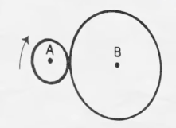

### Can you solve this SAT question?

I've seen this [Veritasium video](https://www.youtube.com/watch?v=ZC98ZK6Ivug) and wanted to try this out.

Here's the SAT question from 1982:



```
In the figure above, the radius of the circle A is 1/3 the radius of the circle B. Starting from the position shown in the figure, circle A rolls around circle B. At the end of how many revolutions of the circle A will the center of the circle first reach its starting point?
``` 
(A) $\frac{3}{2}$ 

(B) $3$

(C) $6$ 

(D) $\frac{9}{2}$

(E) $9$

----

The thing is that every single option on the test was wrong.

I've created a simple script to test this and visualize the correct result.

Here's the demo video, so you don't have to run the code yourself:

<video loop src="media/video.mp4"></video> 

Right answer was 4.